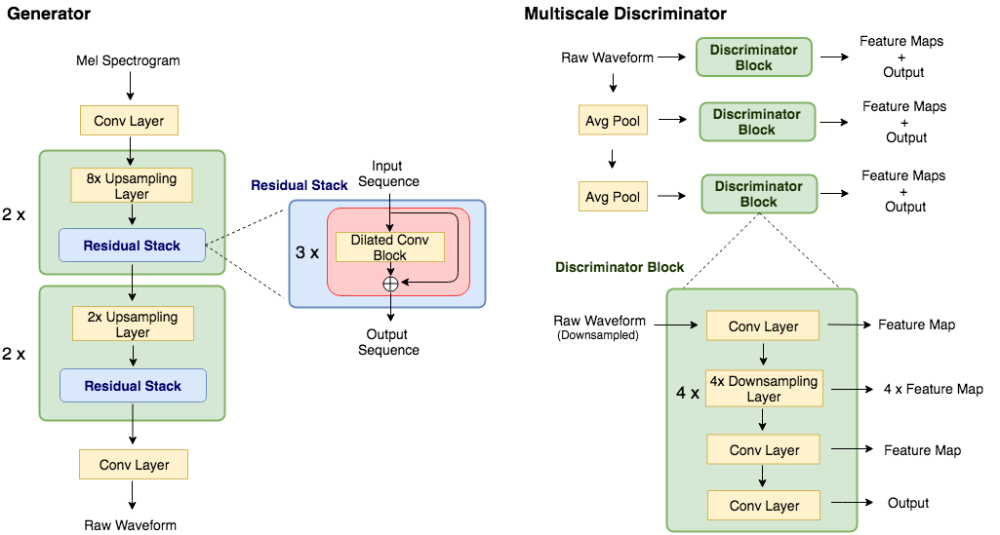
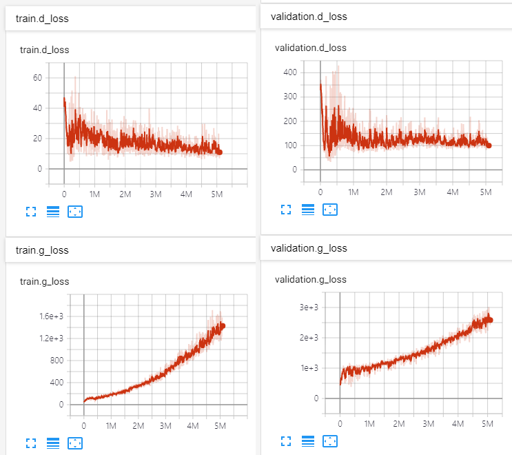

# MelGAN
Unofficial PyTorch implementation of [MelGAN vocoder](https://arxiv.org/abs/1910.06711)

## Key Features

- MelGAN is lighter, faster, and better at generalizing to unseen speakers than [WaveGlow](https://github.com/NVIDIA/waveglow).
- This repository use identical mel-spectrogram function from [NVIDIA/tacotron2](https://github.com/NVIDIA/tacotron2), so this can be directly used to convert output from NVIDIA's tacotron2 into raw-audio.
- Pretrained model on LJSpeech-1.1 via [PyTorch Hub](https://pytorch.org/hub).



## Prerequisites

Tested on Python 3.6
```bash
pip install -r requirements.txt
```

## Prepare Dataset

- Download dataset for training. This can be any wav files with sample rate 22050Hz. (e.g. LJSpeech was used in paper)
- preprocess: `python preprocess.py -c config/default.yaml -d [data's root path]`
- Edit configuration `yaml` file

## Train & Tensorboard

- `python trainer.py -c [config yaml file] -n [name of the run]`
  - `cp config/default.yaml config/config.yaml` and then edit `config.yaml`
  - Write down the root path of train/validation files to 2nd/3rd line.
  - Each path should contain pairs of `*.wav` with corresponding (preprocessed) `*.mel` file.
  - The data loader parses list of files within the path recursively.
- `tensorboard --logdir logs/`

## Pretrained model

Try with Google Colab: TODO

```python
import torch
vocoder = torch.hub.load('seungwonpark/melgan', 'melgan')
vocoder.eval()
mel = torch.randn(1, 80, 234) # use your own mel-spectrogram here

if torch.cuda.is_available():
    vocoder = vocoder.cuda()
    mel = mel.cuda()

with torch.no_grad():
    audio = vocoder.inference(mel)
```

## Inference

- `python inference.py -p [checkpoint path] -i [input mel path]`

## Results

See audio samples at: http://swpark.me/melgan/.
Model was trained at V100 GPU for 14 days using LJSpeech-1.1.




## Implementation Authors

- [Seungwon Park](http://swpark.me) @ MINDsLab Inc. (yyyyy@snu.ac.kr, swpark@mindslab.ai)
- Myunchul Joe @ MINDsLab Inc.
- [Rishikesh](https://github.com/rishikksh20) @ DeepSync Technologies Pvt Ltd.

## License

BSD 3-Clause License.

- [utils/stft.py](./utils/stft.py) by Prem Seetharaman (BSD 3-Clause License)
- [datasets/mel2samp.py](./datasets/mel2samp.py) from https://github.com/NVIDIA/waveglow (BSD 3-Clause License)
- [utils/hparams.py](./utils/hparams.py) from https://github.com/HarryVolek/PyTorch_Speaker_Verification (No License specified)

## Useful resources

- [How to Train a GAN? Tips and tricks to make GANs work](https://github.com/soumith/ganhacks) by Soumith Chintala
- [Official MelGAN implementation by original authors](https://github.com/descriptinc/melgan-neurips)
- [Reproduction of MelGAN - NeurIPS 2019 Reproducibility Challenge (Ablation Track)](https://openreview.net/pdf?id=9jTbNbBNw0) by Yifei Zhao, Yichao Yang, and Yang Gao
  - "replacing the average pooling layer with max pooling layer and replacing reflection padding with replication padding improves the performance significantly, while combining them produces worse results"
